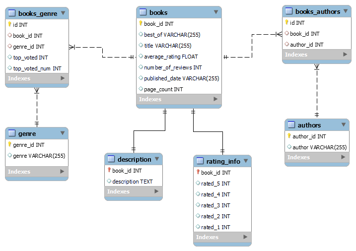

# Goodreads web scraper

The program extracts the information of the top 2020 books from the Goodreads website.

## Description

The Goodreads website gives various details on books, including a users based evaluation 
and genre determination. This program extracts from Goodreads information on the top 2020
books according to the website user-based evaluation.

For each book, the system extracts the following details:
  - Title
  - Author
  - Description
  - Genre (A dictionary of top voted generes with their number of votes)
  - Rating histogram (Number of voters per number of stars)
  - Page count and publication date.

The program saves all the information in a local MySQL DataBase.

## Getting Started

### Dependencies

In order to use the program, the following python packages must be installed in 
the interpreter running the program:
  - beautifulsoup4 version 4.9.3
  - bs4 version 0.0.1
  - certifi version 2021.5.30
  - chardet version 4.0.0
  - idna version 2.10
  - requests version 2.25.1
  - soupsieve version 2.2.1
  - urllib3 version 1.26.5
  - selenium version 3.141.0 (with Chrome web driver)
  - pymysql version 0.10.1
  - pandas version 1.2.4

### Installing

- The program can be run using a terminal or cmd in a python environment satisfying the requirements 
described in the dependencies section. 
- A Chrome web driver executable must be placed in your path in order for selenium to work 
  (See https://selenium-python.readthedocs.io/installation.html#drivers for more details).
- A MySQL server must be installed on the local machine.
- The program also extracts page count and year of publishing through an API 
  so an API key is required. Please check the following links in order to setup
  your own API key: https://console.developers.google.com/?authuser=1,
  https://developers.google.com/books/docs/v1/using?authuser=1.
  Please save the key as `main_code/config/API_key.py` and inside the file 
  create the variable `API_KEY = {your API key}`

### Executing the program

* How to run the program:
  
  In order to run the program execute the file `main.py`. There are two main 
  functionalities to the program:
  * Initializing the database  - Provide the optional argument `-r` in order to 
    create the DataBase with all the necessary tables (if the database exists
    this will overwrite).
  * Actual scraping - This part of the program performs the scraping and saves 
    the data in a local mysql server. 
    There are also optional arguments for this part that allow the user to choose 
    a genre to scrape, page in the genre section and to which page to scrape 
    (more info provided in the Help section).

## Database
The program creates and uses a MySQL relational database. The following 
diagram describes the structure of this database:



### Tables
#### books
The main table containing information on the books stored in the database. 

Columns:
- book_id (INT): the primary key (PK) of the table.
- best_of (VARCHAR(255)): if the book was obtained from a 'best of ****' page, 
  the name of the corresponding genre will be stored here, otherwise null.
- title (VARCHAR(255)): the title of the book.
- average_rating (FLOAT): the average user rating of the book.
- number_of_reviews (INT): the total number of user reviews the book has.

#### authors
Contains the name of the authors.

Columns:
- author_id (INT): primary key (PK) of the table.
- author (VARCHAR(255)): The name of the author.

#### books_authors
Connects between the table books and authors.

Columns:
- id (INT): the primary key (PK) of the table.
- book_id (INT): foreign key (FK) references PK of the table books.
- author_id (INT): foreign key (FK) references PK of the table authors.

#### description
For each book id the table stores the corresponding book's description.

Columns:
- book_id (INT): the primary key (PK) of the table.
- description (TEXT): the description of the book with the corresponding id.

#### rating_info
For each book id the table stores the corresponding book's rating histogram.

Columns:
- book_id (INT): the primary key (PK) of the table.
- rated_5 (INT): the number of people who gave a five stars rating to the book.
- rated_4 (INT): the number of people who gave a four stars rating to the book.
- rated_3 (INT): the number of people who gave a three stars rating to the book.
- rated_2 (INT): the number of people who gave a two stars rating to the book.
- rated_1 (INT): the number of people who gave a one-star rating to the book.

#### genre
Stores all the genre from all the books in the database.

Columns:
- genre_id (INT): the primary key (PK) of the table.
- genre (VARCHAR(255)): contains genre names.

#### books_genre
A connecting table for the books and genre table based on users' genre ratings.

Columns:
- id (INT): the primary key (PK) of the table.
- book_id (INT): foreign key (FK) references PK of the table books.
- genre_id (INT): foreign key (FK) references PK of the table genre.
- top_voted (INT): the rank of this genre among all top-voted genres for this 
book.
- top_voted_num (INT): the number of users who voted for this genre.

## Help

`main_code/goodreads_scraper.py` operation:
```
usage: goodreads_scraper.py [-h] [-g GENRE] [-p PAGE_NUM] [-t TO_PAGE]

Has several optional arguments for scraping specific genres. By default if no arguments are provided will scrape the "best books of 2020" page.

optional arguments:
  -h, --help            show this help message and exit
  -g GENRE, --genre GENRE
                        genre -- Must be a string representing the desired genre/shelf from Goodreads (goodreads.com/shelf)
  -p PAGE_NUM, --page_num PAGE_NUM
                        page_num -- The page number to be scraped (E.g. goodreads.com/shelf/show/(genre)?page=1)
  -t TO_PAGE, --to_page TO_PAGE
                        to_page -- To which page to scrape
  -r, --reload-tables   reset-tables -- reloads the sql tables
```


## Authors

ex. Ilia Altmark

ex. Tovi Benoni

## Version History

Currently redundent

## License

Currently redundent
